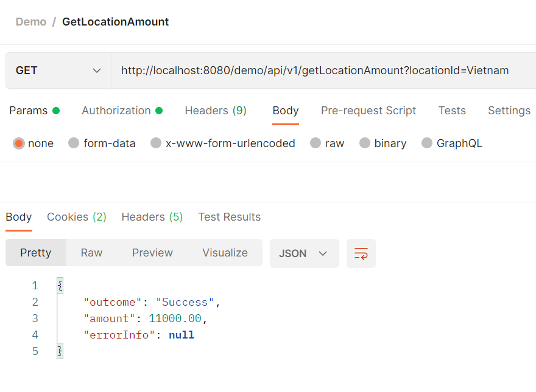
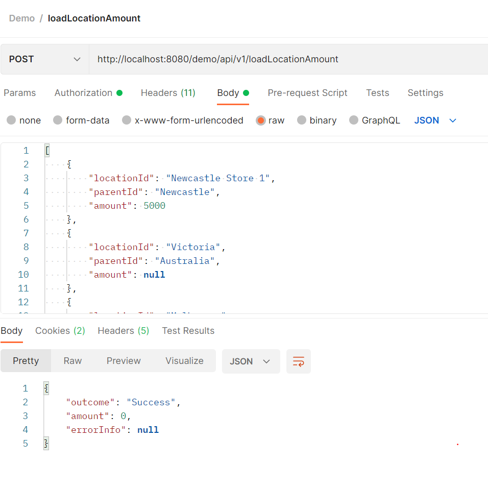
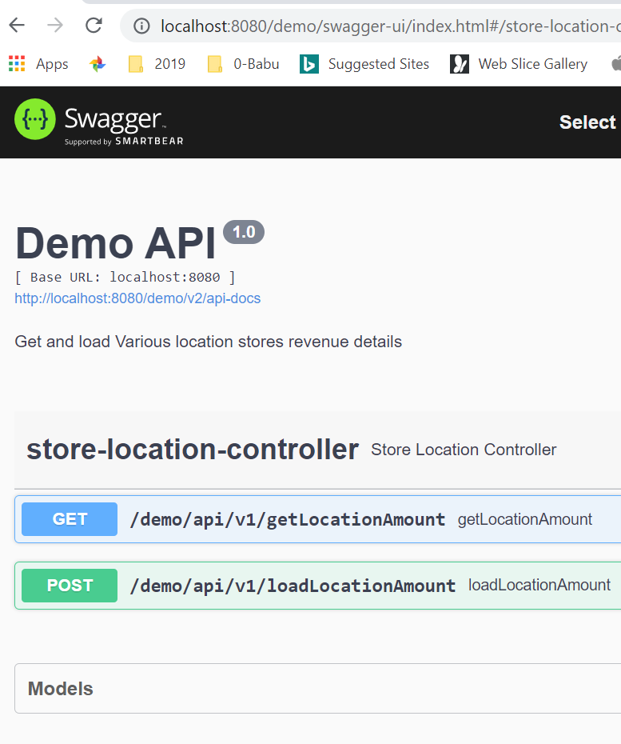
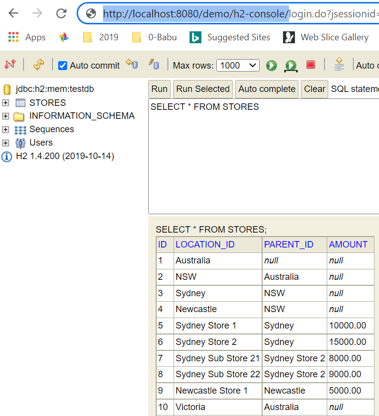

Stores Location - DEMO - API

1. This sample Demo application will be helpful to find particular store and its sub-store revenues.

2 .This application implemented in Spring Boot, REST and H2 DB.

3.  run the project
    import application as gradle project
    gradle clean
    gradle build
    Run DemoApplication
    
4. This sample application have two RESTful endpoints:
   GET /api/v1/getLocationAmount - To get stores total amount based on Location id
   POST /api/v1/loadLocationAmount - To load stores revenue details to H2 in-memory DB
   
   

   

5. To access swagger-API docs
   http://localhost:8080/demo/swagger-ui/index.html#/
   
    
   
6. H2-console
   http://localhost:8080/demo/h2-console/
   