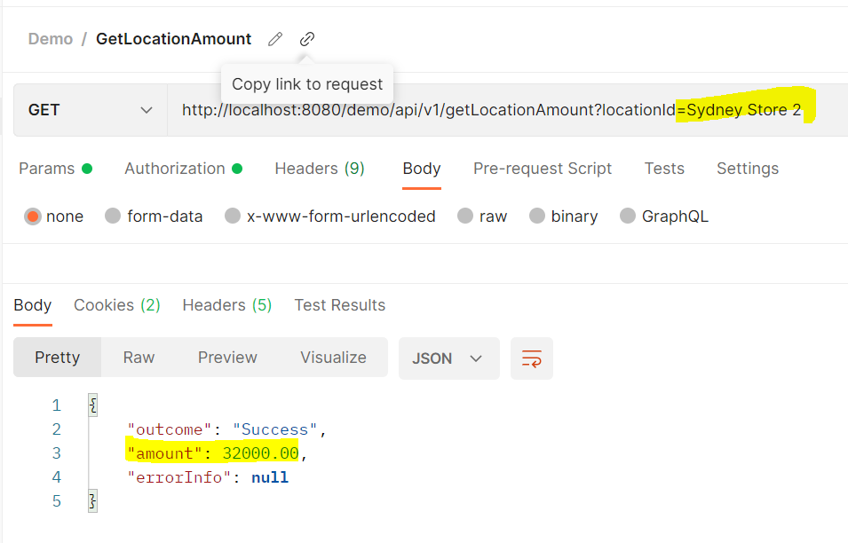

Stores Location - DEMO - API

1. This sample Demo application will be helpful to find particular store and its sub-store revenues.

2. This application implemented in Spring Boot, REST and H2 DB.

3.  Run application in local environment.
    Required: JDK 1.8 and Gradle
    import application as gradle project
    gradle clean
    gradle build
    Run DemoApplication
    Run springboot application http://localhost:8080/demo/
    Embedded tomcat server started - Example logs: Tomcat server started on port(s):8080 (http) with context path '/demo'
    
4. This sample application have two RESTful endpoints:
   GET /api/v1/getLocationAmount - To get stores total amount based on Location id
   POST /api/v1/loadLocationAmount - To load stores revenue details to H2 in-memory DB
   
   
   
   
   
   

5. To access swagger-API docs
   http://localhost:8080/demo/swagger-ui/index.html#/
   
    
   
6. H2-console
   Default few sample records were stored in H2 DB.
   Using POST /api/v1/loadLocationAmount endpoint, user can load additional stores location details.
   http://localhost:8080/demo/h2-console/
   

   Notes: DB-User details are available in application properties.(In real world, this can be stored in secrets/config maps) For Local Set-up, keep credentials in ENV variables.